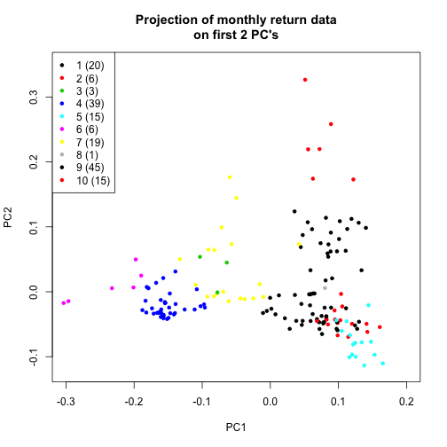
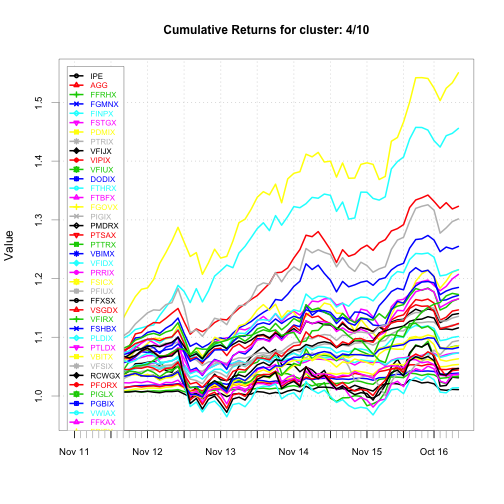
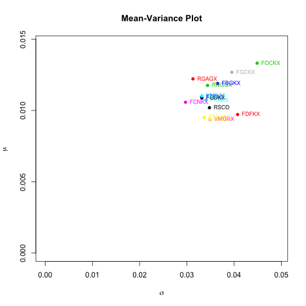
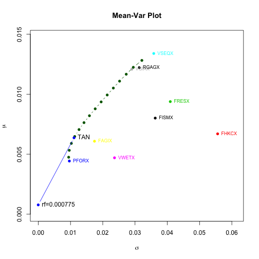

# Optimize your 401-k

* [Abstract](#Abstract)
* [Load Libraries](#Load-Libraries)
* [Download Monthly Quotes](#Download-Fund-Ticker-Quotes)
* [Compute Monthly Returns](#Compute-Simple-Returns)
* [Clustering](#Clustering)
* [PCA: Visualizing Clusters](#PCA--Visualizing-Clusters)
* [Chart Cumulative Returns](#Chart-Cumulative-Returns)
* [Qualitative Evaluation of Clusters](#Qualitative-Evaluation-of-Clusters)
* [Plot Selected Funds on PCA Chart](#Plot-Selected-Funds-on-PCA-Chart)
* [Mean-Var Analysis of Selected Funds](#Mean-Var-Analysis-of-Selected-Funds)
* [Portfolio Analysis of Selected Funds](#Portfolio-Analysis-of-Selected-Funds)
* [Back-test Selected Portfolio](#Back-test-Selected-Portfolio)
* [Null Funds](#Null-Funds)
* [Include Null Funds](#Include-Null-Funds)
* [Future](#Future)


## <a name="Abstract"></a>Abstract

Allocating money across the various investment funds available in your 401-k 
account can be challenging.  Some 401-k managers offer hundreds of funds to choose from.
The large number of options makes it difficult to construct an optimal investment portfolio. 

This article tackles the problem using the following strategy:

1. Reduce the number of options by sorting the funds into a set of
"clusters" based on similarity between the funds' monthly rate-of-returns
(i.e. funds with highly correlated monthly returns are sorted together in the same cluster).
2. Select a single "representative fund" from each cluster.  
3. Combine the representative funds into an optimal investment portfolio.

Step 1 involved using K-means clustering to cluster funds based on the 
past 5 years of monthly returns.  The optimal number of clusters (10) was 
decided using multiple cluster evaluation metrics.  The clustering
algorithm performed well, in that funds sorted themselves together as an 
investor might expect them to (large-cap stocks clustered together, high-yield 
bonds clustered together, real estate funds clustered together, etc).

Step 2 involved using mean-variance analysis to select an optimally
performing fund as the "representative fund" for each cluster.  In most
cases the representative fund was easy to choose as it dominated the 
mean-variance analysis (the fund produced the best mean return at nearly the 
lowest volatility).  In other cases, where no fund clearly dominated
the cluster, the representative fund was selected by trading off return 
and volatility (in a somewhat arbitrary manner according to my own risk appetite).

Step 3 involved using standard mean-variance portfolio analysis to determine
an optimal allocation strategy across the representative funds.

Note that this strategy generalizes to any set of assets, not just 401-k mutual funds.

**Caveat emptor**: It goes without saying that correlation does not equal causation,
that past results do not guarantee future performance.  This article does not constitute 
investment advice.  Trade at your own risk.


## <a name="Load-Libraries"></a>Load Libraries


```r
    library(tseries)                # get.hist.quote
    library(zoo)                    # coredata
    library(quadprog)               # solve.QP
    library(PerformanceAnalytics)   # chart.*
    library(dplyr)                  # mutate, arrange, filter

    source("mean-var.R")
    source("my401k-functions.R")
    source("my401k-etl.R")
    source("my401k-clustering.R")

    options(width=150)              # R results display width
    options(scipen=7)               # favor fixed notation over scientific notation
```


## <a name="Download-Fund-Ticker-Quotes"></a>Download Monthly Quotes


```r
    funds.df <- My401kEtl$loadFundList()

    #
    # zoo time-series object
    # rows: monthly quotes
    # cols: funds
    #
    quotes.zoo <- My401kEtl$loadAllTickerQuotes(funds.df)
```

```
## <simpleError in read.table(file, ...): no lines available in input>
## <simpleError in read.table(file, ...): no lines available in input>
## <simpleError in read.table(file, ...): no lines available in input>
```

```
## Warning in merge.zoo(IPE = structure(c(37.778111, 38.771748, 39.533615, : Index vectors are of different classes: Date Date Date Date Date integer
## Date Date Date Date Date Date Date Date Date Date integer integer Date Date Date Date Date Date Date Date Date Date Date Date Date Date Date Date Date
## Date Date Date Date Date Date Date Date Date Date Date Date Date Date Date Date Date Date Date Date Date Date Date Date Date Date Date Date Date Date
## Date Date Date Date Date Date Date Date Date Date Date Date Date Date Date Date Date Date Date Date Date Date Date Date Date Date Date Date Date Date
## Date Date Date Date Date Date Date Date Date Date Date Date Date Date Date Date Date Date Date Date Date Date Date Date Date Date Date Date Date Date
## Date Date Date Date Date Date Date Date Date Date Date Date Date Date Date Date Date Date Date Date Date Date Date Date Date Date Date Date Date Date
## Date Date Date Date Date Date Date Date Date Date Date Date Date Date Date Date Date Date Date Date Date Date Date Date Date Date Date Date Date Date
## Date Date
```

```r
    #
    # print the number of monthly quotes for each fund
    #
    quote.counts <- apply( !is.na(quotes.zoo),2,sum)
    sort(quote.counts, decreasing=T)
```

```
##  ^RUA ^GSPC   IWO   IWN   IBM FNMIX PEBIX FAGIX FFRHX SPHIX PHIYX FGMNX FSTGX PDMIX PTRIX DODIX FTHRX FGOVX PIGIX PMDRX PTSAX PTTRX PGOVX PRRIX FSICX 
##   193   193   193   193   193   193   193   193   193   193   193   193   193   193   193   193   193   193   193   193   193   193   193   193   193 
## FFXSX FSHBX PLDIX PTLDX VFSIX PFORX PIGLX PGBIX FCVSX VCVSX DODBX VGSTX FGBLX PSTKX VDIGX VFTNX FTQGX FLCSX FTRNX DODGX VMCIX VSEQX VMGRX VASVX DFSTX 
##   193   193   193   193   193   193   193   193   193   193   193   193   193   193   193   193   193   193   193   193   193   193   193   193   193 
## FSLCX VSCIX FSCRX FDSCX DFFVX FRESX DFEVX DFEMX FPBFX FIEUX DFALX VTRIX DFIVX VINEX DFISX FJPNX FLATX FICDX FHKCX FSEAX VHGEX VFIJX VFIUX VFIDX VUSUX 
##   193   193   193   193   193   193   193   193   193   193   193   193   193   193   193   193   193   193   193   193   193   192   192   192   192 
## VWETX VSGDX VFIRX DODFX VWIAX VWENX VGIAX VMRAX VWNAX VEIRX VWILX VWEAX PRAIX VWNEX VEXRX FINPX PCRIX PAAIX  ^RLG  ^RLV FISMX FTBFX FRIFX PDIIX   AGG 
##   192   192   192   190   189   189   189   189   189   186   186   183   183   183   183   176   175   174   173   173   173   172   169   162   161 
## PRRSX PAUIX VIPIX PFUIX FIREX VPCCX   VWO DFEOX  RSCO VBIMX VBLLX DFVEX PELBX   HYG   IPE  ACWX FBAKX FDGKX FFDKX FBGKX FCAKX FCNKX FEXKX FGCKX FGDKX 
##   160   159   158   153   149   146   143   137   135   133   133   133   121   118   117   106   105   105   105   105   105   105   105   105   105 
## FDFKX FOCKX FEIKX FLCKX FLPKX FVSKX FKMCX FVLKX FIDKX FOSKX FDIKX DODWX DFGEX PFIUX DFVQX   LWC RCWGX RLBGX RFNGX RICGX RAFGX RGAGX RNGGX RMFGX RWMGX 
##   105   105   105   105   105   105   105   105   105   105   105   105   104   103   102    95    93    93    93    93    93    93    93    93    93 
## RLLGX RNWGX RERGX RWIGX RIGGX RNPGX FFKVX FFKCX FKVFX FFKDX FKTWX FFKEX FKTHX FFKFX FFKGX FFKHX FFKAX FDENX VBITX 
##    93    93    93    93    93    93    91    91    91    91    91    91    91    91    91    91    91    68    65
```


## <a name="Compute-Simple-Returns"></a>Compute Monthly Returns


```r
    simple.returns.zoo <- My401k$computeSimpleReturns(quotes.zoo)

    simple.returns.fees.zoo <- My401k$computeSimpleReturnsWithFees(simple.returns.zoo,
                                                                   funds.df)

    simple.returns.stats.df <- My401k$computeSimpleReturnsStats(simple.returns.zoo)
    simple.returns.fees.stats.df <- My401k$computeSimpleReturnsStats(simple.returns.fees.zoo)

    # fundsx.df <- merge(funds.df, simple.returns.stats.df, by=0, all.x=T)

    #
    # Extract the core matrix data
    # transpose: each row is a fund, each col is a monthly return
    #
    simple.returns.mat <- t( coredata(simple.returns.zoo) )
```


## <a name="Clustering"></a>Clustering


```r
    #
    # list of objects returned by kmeans()
    # one for each number-of-clusters (4:14)
    #
    km.list <- My401kClustering$generateKmeansResults(simple.returns.mat, 4:14)

    #
    # Various measures to evaluate clustering results
    # Some measures (DB, SD) suggest 9 clusters
    # Other measures (R^2, Hartigan) suggest 11 clusters
    # Go with 10?
    #
    km.eval <- My401kClustering$evaluateKmeansResults(km.list, simple.returns.mat)
    data.frame(km.eval)
```

```
##    num.clusters hartigan.score r.squared s.dbw       sd        db
## 1             4      15.653556 0.5774665   Inf 13.17162 1.3002868
## 2             5      21.889203 0.6142827   Inf 22.34053 1.4476565
## 3             6      14.726657 0.6599481   Inf 20.43790 1.2646341
## 4             7      15.595816 0.6882847   Inf 22.96410 1.2926787
## 5             8      15.270543 0.7158134   Inf 22.10195 1.1706961
## 6             9      15.380979 0.7405733   Inf 19.24300 0.9957847
## 7            10      13.151824 0.7634556   Inf 22.38347 1.0321809
## 8            11       7.451145 0.7816324   Inf 23.67971 1.0426896
## 9            12      15.188145 0.7915264   Inf 31.39795 1.1617923
## 10           13       3.190338 0.8100226   Inf 21.68068 0.9461831
## 11           14       0.000000 0.8138540   Inf 33.28570 1.1676305
```

```r
    km <- km.list[[7]]      # 10 clusters
```

## <a name="PCA--Visualizing-Clusters"></a>PCA: Visualizing Clusters


```r
    pca <- prcomp(simple.returns.mat, 
                  center = T)

    #
    # 90% of variance is explained by first 9 principal components.
    # This also suggests using ~9 clusters, tho I can't explain why.
    #
    summary(pca)$importance[,1:11]
```

```
##                             PC1        PC2        PC3       PC4        PC5        PC6        PC7        PC8       PC9       PC10     PC11
## Standard deviation     0.116494 0.06963385 0.04603233 0.0390792 0.02995912 0.02721734 0.02498407 0.02359252 0.0211901 0.01913384 0.016124
## Proportion of Variance 0.483830 0.17287000 0.07555000 0.0544500 0.03200000 0.02641000 0.02225000 0.01984000 0.0160100 0.01305000 0.009270
## Cumulative Proportion  0.483830 0.65671000 0.73226000 0.7867000 0.81870000 0.84511000 0.86737000 0.88721000 0.9032200 0.91627000 0.925540
```

```r
    #
    # pca$x is the projection of simple.returns.mat (centered) onto the principal components.
    # Use the first two principal components to project the high-dimensional data onto a plane
    # for visualization.
    # 
    proj.2d <- pca$x[,1:2]
    plot(proj.2d, 
         col=km$cluster, 
         pch=20,
         xlim=c(-0.3,0.2), 
         ylim=c(-0.12,0.35))
    title("Projection of monthly return data\non first 2 PC's")

    #
    # legend: cluster id (# of funds in cluster)
    #
    legend.text = sapply(1:10, function(i) { paste(toString(i), " (", toString(km$size[i]), ")", sep="") })
    legend(x="topleft", legend=legend.text, col=1:10, pch=20)
```



```r
    #
    # Include 3rd PC
    #
    proj.2d <- pca$x[,3:2]
    plot(proj.2d, 
         col=km$cluster, 
         pch=20, 
         xlim=c(-0.3,0.2), 
         ylim=c(-0.12,0.35))
    title("Projection of monthly return data\non 2nd and 3rd PC's")
```


## <a name="Chart-Cumulative-Returns"></a>Chart Cumulative Returns


```r
    #
    # list of vectors of ticker symbols 
    #
    cluster.tickers.list <- My401kClustering$getClusterTickersList( km ) 

    #
    # list of lists of funds
    #
    cluster.funds.list <- My401kClustering$getClusterFundsList( cluster.tickers.list, funds.df) 

    My401k$chartCumulativeReturns( simple.returns.fees.zoo,
                                   simple.returns.fees.stats.df,
                                   cluster.tickers.list,
                                   cluster.funds.list )
```


```
##    ticker                 name       asset.class               category     fod fees        mean         sd weighted.mean cum.return
## 1   FISMX   FID INTL SMALL CAP Stock Investments  Foreign Sm/Mid Growth Foreign 1.32 0.008008333 0.03625892   0.006784262   1.598915
## 2   FPBFX    FID PACIFIC BASIN Stock Investments   Diversified Pac/Asia Foreign 1.17 0.007756019 0.03691017   0.006024825   1.571251
## 3   DFISX  DFA INTL SMALL CO I Stock Investments   Foreign Sm/Mid Value Foreign 0.54 0.007435671 0.03772653   0.006428529   1.536570
## 4   VINEX VANG INTL EXPLOR INV Stock Investments  Foreign Sm/Mid Growth Foreign 0.42 0.007325119 0.03680704   0.005672022   1.528838
## 5   FOSKX       FID OVERSEAS K Stock Investments    Foreign Large Blend Foreign 0.91 0.007184319 0.03610243   0.004782383   1.517815
## 6   FIREX FID INTL REAL ESTATE Stock Investments     Global Real Estate Foreign 1.12 0.007230884 0.03837364   0.003640620   1.515081
## 7   DFVQX DFA INTL VECTOR EQ I Stock Investments   Foreign Sm/Mid Value Foreign 0.50 0.006365979 0.03931217   0.005231851   1.429861
## 8   VWILX VANG INTL GROWTH ADM Stock Investments    Foreign Large Blend Foreign 0.34 0.006366783 0.04137728   0.005138418   1.422534
## 9   DODFX DODGE & COX INTL STK Stock Investments    Foreign Large Value Foreign 0.64 0.006414258 0.04277871   0.004686562   1.421135
## 10  RERGX AF EUROPAC GROWTH R6 Stock Investments    Foreign Large Blend Foreign 0.50 0.005638068 0.03428187   0.003809751   1.381045
## 11  FJPNX            FID JAPAN Stock Investments            Japan Stock Foreign 0.80 0.005771246 0.03819850   0.004982486   1.380995
## 12  FDIKX FID DIVERSIFD INTL K Stock Investments   Foreign Large Growth Foreign 0.87 0.005451850 0.03546595   0.003071699   1.361196
## 13  FIDKX FID INTL DISCOVERY K Stock Investments    Foreign Large Blend Foreign 0.86 0.005302527 0.03587079   0.002645302   1.346999
## 14  FIEUX           FID EUROPE Stock Investments           Europe Stock Foreign 1.03 0.005312257 0.04053237   0.001956536   1.332727
## 15  DFALX DFA LARGE CAP INTL I Stock Investments    Foreign Large Blend Foreign 0.29 0.005028285 0.03671784   0.003345891   1.321214
## 16  VTRIX  VANGUARD INTL VALUE Stock Investments    Foreign Large Blend Foreign 0.46 0.004824526 0.03877321   0.002862642   1.297859
## 17  DFIVX     DFA INTL VALUE I Stock Investments    Foreign Large Value Foreign 0.63 0.004827110 0.04224156   0.003841744   1.286444
## 18  RIGGX AF INTL GTH & INC R6 Stock Investments            World Stock Foreign 0.58 0.004140316 0.03268878   0.001705685   1.259603
## 19   ACWX   INTL STOCK MKT IDX Stock Investments   International Stocks Foreign 0.09 0.004124311 0.03704054   0.002912483   1.246217
## 20  RNWGX      AF NEW WORLD R6 Stock Investments Diversified Emerg Mkts Foreign 0.65 0.003827660 0.03445153   0.002755730   1.230173
```


```
##   ticker                 name       asset.class               category     fod fees         mean         sd weighted.mean cum.return
## 1  FHKCX     FID CHINA REGION Stock Investments  Pacific/Asia ex-Japan Foreign 0.99  0.006696411 0.05559823   0.004963179  1.3892725
## 2  FSEAX    FID EMERGING ASIA Stock Investments  Pacific/Asia ex-Japan Foreign 1.09  0.004354461 0.04311653   0.003826233  1.2457101
## 3    VWO EMERGING MKT STK IDX Stock Investments Emerging Markets Stock Foreign 0.12  0.002398544 0.04667392   0.002788997  1.0887148
## 4  DFEMX DFA EMERGING MARKETS Stock Investments Diversified Emerg Mkts Foreign 0.67  0.001815558 0.04524461   0.002093522  1.0534036
## 5  DFEVX DFA EMERG MKTS VALUE Stock Investments Diversified Emerg Mkts Foreign 0.66  0.001903732 0.05227060   0.003192541  1.0372809
## 6  FLATX    FID LATIN AMERICA Stock Investments    Latin America Stock Foreign 1.13 -0.006153835 0.06095298  -0.003821912  0.5983067
```


```
##   ticker                 name       asset.class           category      fod fees        mean         sd weighted.mean cum.return
## 1  PRRSX PIM RE REAL RET INST Stock Investments        Real Estate Domestic 0.94 0.009917391 0.05157974   0.008208414   1.730727
## 2  FRESX FID REAL ESTATE INVS Stock Investments        Real Estate Domestic 0.78 0.009382524 0.04092476   0.008054784   1.726088
## 3  DFGEX DFA GLOB REAL ESTATE Stock Investments Global Real Estate  Foreign 0.38 0.008154751 0.03653041   0.006350488   1.613179
```



```
##    ticker                 name              asset.class               category      fod fees         mean          sd  weighted.mean cum.return
## 1   FRIFX  FID REAL ESTATE INC        Stock Investments            Real Estate Domestic 0.83 0.0069889660 0.015194372  0.00563444089   1.550447
## 2   VWIAX   VANG WELLESLEY ADM Blended Fund Investments    Conservative Alloc. Domestic 0.16 0.0059618837 0.012522198  0.00496981670   1.455778
## 3   PFORX   PIM FOR BD US$HG I         Bond Investments             World Bond  Foreign 0.51 0.0044295266 0.009643644  0.00358972237   1.323065
## 4   PIGIX PIM INVT GRD BD INST         Bond Investments Intermediate-Term Bond Domestic 0.53 0.0042146756 0.013360629  0.00325803239   1.301557
## 5   PGBIX  PIM GLOB BD US$HG I         Bond Investments             World Bond  Foreign 0.57 0.0035975493 0.009518622  0.00288342480   1.254815
## 6   VFIDX VANG INTM INV GR ADM         Bond Investments Intermediate-Term Bond Domestic 0.10 0.0031020735 0.010348725  0.00245480796   1.215142
## 7   FSICX FID STRATEGIC INCOME         Bond Investments       Multisector Bond Domestic 0.71 0.0031156424 0.011989265  0.00280640117   1.214799
## 8   FFKAX FID FREEDOM K INCOME Blended Fund Investments  Target-Date 2005-2055 Domestic 0.44 0.0029885359 0.009392257  0.00272613374   1.207095
## 9   DODIX   DODGE & COX INCOME         Bond Investments Intermediate-Term Bond Domestic 0.43 0.0026859626 0.008013318  0.00221829538   1.184899
## 10  FFRHX  FID FLOAT RT HI INC         Bond Investments        High Yield Bond Domestic 0.70 0.0025250215 0.007809550  0.00242450818   1.172912
## 11  VBIMX  VANG INTM BOND INST         Bond Investments Intermediate-Term Bond Domestic 0.06 0.0025491918 0.012277887  0.00193527014   1.171400
## 12  PTTRX    PIM TOTAL RT INST         Bond Investments Intermediate-Term Bond Domestic 0.47 0.0024483473 0.010434388  0.00157761690   1.165416
## 13  FTBFX       FID TOTAL BOND         Bond Investments Intermediate-Term Bond Domestic 0.45 0.0024324174 0.008888990  0.00214153977   1.165327
## 14  PTSAX  PIM TOT RT III INST         Bond Investments Intermediate-Term Bond Domestic 0.55 0.0021900155 0.010026048  0.00140055757   1.146653
## 15  PMDRX   PIM MOD DURAT INST         Bond Investments Intermediate-Term Bond Domestic 0.48 0.0020806788 0.007310114  0.00131841579   1.140362
## 16  PTRIX PIM MORTGAGE BCKD IS         Bond Investments     Intermediate Gov't Domestic 0.50 0.0020079953 0.006185539  0.00176954672   1.135620
## 17    AGG    TOTAL BOND MARKET         Bond Investments                  Bonds Domestic 0.06 0.0018580140 0.008613494  0.00158050985   1.123521
## 18  VFSIX VANG ST INVT GR INST         Bond Investments        Short-Term Bond Domestic 0.07 0.0018076810 0.003839452  0.00156386670   1.122013
## 19  VFIJX        VANG GNMA ADM         Bond Investments     Intermediate Gov't Domestic 0.11 0.0017407668 0.006900788  0.00160560118   1.116069
## 20  FTHRX    FID INTERMED BOND         Bond Investments Intermediate-Term Bond Domestic 0.45 0.0015303475 0.006410096  0.00116244607   1.101391
## 21  PFIUX PIM UNCONSTRNED BD I         Bond Investments       Multisector Bond Domestic 0.99 0.0014449258 0.008448524  0.00116075862   1.094349
## 22  PDMIX        PIM GNMA INST         Bond Investments     Intermediate Gov't Domestic 0.50 0.0013068834 0.006461956  0.00112857076   1.085749
## 23  VFIUX  VANG INTM TREAS ADM         Bond Investments     Intermediate Gov't Domestic 0.10 0.0013335179 0.009835849  0.00104250564   1.085726
## 24  FGMNX             FID GNMA         Bond Investments     Intermediate Gov't Domestic 0.45 0.0012634701 0.006656360  0.00102047943   1.082655
## 25  PLDIX PIM LOW DUR III INST         Bond Investments        Short-Term Bond Domestic 0.52 0.0011175026 0.004556885  0.00061278342   1.073395
## 26  PTLDX     PIM LOW DUR INST         Bond Investments        Short-Term Bond Domestic 0.51 0.0011184303 0.004837313  0.00063015566   1.073370
## 27  FGOVX FIDELITY GOVT INCOME         Bond Investments Intermediate-Term Bond Domestic 0.45 0.0009936266 0.008130754  0.00066480396   1.063410
## 28  VBITX  VANG ST BOND IDX IS         Bond Investments        Short-Term Bond Domestic 0.06 0.0008239643 0.003653541  0.00081577530   1.053684
## 29    IPE  INFL PROTECTED BOND         Bond Investments                  Bonds Domestic 0.03 0.0008220049 0.014501661  0.00062530447   1.047003
## 30  VSGDX  VANG ST FEDERAL ADM         Bond Investments       Short Government Domestic 0.10 0.0007188165 0.002924732  0.00064667682   1.046780
## 31  VIPIX  VANG INFL PROT INST         Bond Investments     Intermediate Gov't Domestic 0.07 0.0007729540 0.013937854  0.00043910028   1.044257
## 32  FSHBX  FID SHORT TERM BOND         Bond Investments        Short-Term Bond Domestic 0.45 0.0006006612 0.002202326  0.00046587827   1.039020
## 33  FSTGX FID INTM GOVT INCOME         Bond Investments     Intermediate Gov't Domestic 0.45 0.0005833425 0.005925797  0.00033516557   1.036882
## 34  PRRIX PIM REAL RETURN INST         Bond Investments        Long Government Domestic 0.58 0.0006805496 0.015439015  0.00025964186   1.036644
## 35  PIGLX   PIM GLOB BD UNHG I         Bond Investments             World Bond  Foreign 0.57 0.0006634679 0.015104351  0.00026036795   1.035867
## 36  VFIRX VANG ST TREASURY ADM         Bond Investments       Short Government Domestic 0.10 0.0005074524 0.002587951  0.00051313436   1.032784
## 37  RCWGX AF CAP WORLD BOND R6         Bond Investments             World Bond  Foreign 0.53 0.0005798703 0.014347144 -0.00003695957   1.031064
## 38  FINPX FID INFLAT PROT BOND         Bond Investments     Intermediate Gov't Domestic 0.45 0.0003132719 0.013737298  0.00013342810   1.014172
## 39  FFXSX    FID LTD TERM GOVT         Bond Investments       Short Government Domestic 0.45 0.0001757222 0.003530759  0.00006783611   1.010912
```


```
##    ticker                 name       asset.class         category      fod fees        mean         sd weighted.mean cum.return
## 1   VSEQX    VANG STRATEGIC EQ Stock Investments    Mid-Cap Blend Domestic 0.21 0.013392849 0.03580194   0.012079258   2.252092
## 2   DFFVX  DFA US TARGET VALUE Stock Investments      Small Value Domestic 0.37 0.012630401 0.04070270   0.011247103   2.121909
## 3   DFSTX   DFA US SMALL CAP I Stock Investments      Small Blend Domestic 0.37 0.012405009 0.03915674   0.011197248   2.099688
## 4   DFVEX   DFA US VECTOR EQ I Stock Investments    Mid-Cap Value Domestic 0.32 0.012046270 0.03636835   0.010491376   2.065672
## 5   FSCRX FID SM CAP DISCOVERY Stock Investments     Small Growth Domestic 1.01 0.012057087 0.03764231   0.009438955   2.061308
## 6   VSCIX VANG SM CAP IDX INST Stock Investments      Small Blend Domestic 0.07 0.012004291 0.03657015   0.010475394   2.058969
## 7     IWN  SMALL-CAP VALUE IDX Stock Investments Small-Cap Stocks Domestic 0.05 0.012038611 0.03987122   0.011547559   2.048077
## 8   FVLKX          FID VALUE K Stock Investments    Mid-Cap Value Domestic 0.73 0.011677077 0.03386113   0.009364015   2.028614
## 9   VASVX  VANG SELECTED VALUE Stock Investments    Mid-Cap Value Domestic 0.39 0.011485034 0.03270800   0.010033983   2.008978
## 10    IWO SMALL-CAP GROWTH IDX Stock Investments Small-Cap Stocks Domestic 0.05 0.011610689 0.04345271   0.010034932   1.973455
## 11  FKMCX  FID MID CAP STOCK K Stock Investments   Mid-Cap Growth Domestic 0.61 0.010674784 0.03231120   0.008900193   1.910069
## 12  FLCKX FID LEVERGD CO STK K Stock Investments    Mid-Cap Blend Domestic 0.67 0.010778360 0.03851043   0.007360984   1.896458
## 13  VEXRX    VANG EXPLORER ADM Stock Investments     Small Growth Domestic 0.35 0.010801926 0.03909502   0.009228871   1.896288
## 14  FDSCX   FID STK SEL SM CAP Stock Investments     Small Growth Domestic 0.77 0.009867684 0.03687584   0.008897108   1.796836
## 15  FSLCX  FID SMALL CAP STOCK Stock Investments      Small Blend Domestic 1.00 0.008903874 0.03586352   0.008658896   1.694461
```


```
##   ticker                 name      asset.class        category      fod  fees        mean         sd weighted.mean cum.return
## 1  VWETX   VANG LT INV GR ADM Bond Investments  Long-Term Bond Domestic 0.120 0.004699714 0.02363835  0.0041335657   1.326523
## 2    LWC  LONG-TERM CORP BOND Bond Investments           Bonds Domestic 0.050 0.004092539 0.02534011  0.0039758790   1.272850
## 3  VBLLX  VANG LT BOND IDX IS Bond Investments  Long-Term Bond Domestic 0.060 0.003963894 0.02548397  0.0033764565   1.262165
## 4  VUSUX VANG LT TREASURY ADM Bond Investments Long Government Domestic 0.100 0.003303096 0.03219189  0.0025821308   1.195673
## 5  PGOVX  PIM LT US GOVT INST Bond Investments Long Government Domestic 0.535 0.002888620 0.03146758  0.0020319097   1.166074
## 6  PRAIX PIM RL RT ASSET INST Bond Investments Long Government Domestic 0.730 0.001177063 0.02646795  0.0005994774   1.054461
```


```
##    ticker                 name              asset.class              category      fod  fees          mean         sd weighted.mean cum.return
## 1   FAGIX FID CAPITAL & INCOME         Bond Investments       High Yield Bond Domestic 0.750  0.0060818483 0.01743412  0.0053424945  1.4601660
## 2   FFKDX   FID FREEDOM K 2020 Blended Fund Investments Target-Date 2005-2055 Domestic 0.580  0.0056643013 0.01949503  0.0049410903  1.4185029
## 3   VWEAX VANG HI YLD CORP ADM         Bond Investments       High Yield Bond Domestic 0.130  0.0053533716 0.01369908  0.0045672403  1.3991071
## 4   FKVFX   FID FREEDOM K 2015 Blended Fund Investments Target-Date 2005-2055 Domestic 0.560  0.0052193893 0.01776355  0.0045922340  1.3816825
## 5   PHIYX  PIM HIGH YIELD INST         Bond Investments       High Yield Bond Domestic 0.560  0.0050152949 0.01455467  0.0043211834  1.3682693
## 6   FFKCX   FID FREEDOM K 2010 Blended Fund Investments Target-Date 2005-2055 Domestic 0.530  0.0049099389 0.01618881  0.0041946908  1.3569865
## 7   SPHIX      FID HIGH INCOME         Bond Investments       High Yield Bond Domestic 0.730  0.0047462735 0.01682502  0.0040393769  1.3420370
## 8   FNMIX  FID NEW MARKETS INC         Bond Investments Emerging Markets Bond  Foreign 0.860  0.0048298482 0.02197270  0.0046453626  1.3407409
## 9     HYG  HI YLD EMG MKT BOND         Bond Investments       High Yield Bond  Foreign 0.400  0.0043544057 0.01770920  0.0036540248  1.3076991
## 10  FFKVX   FID FREEDOM K 2005 Blended Fund Investments Target-Date 2005-2055 Domestic 0.490  0.0040432274 0.01326087  0.0035339259  1.2875450
## 11  PDIIX  PIM DIVERS INC INST         Bond Investments      Multisector Bond Domestic 0.760  0.0040238550 0.01453950  0.0035489965  1.2844850
## 12  FGBLX  FID GLOBAL BALANCED Blended Fund Investments      World Allocation  Foreign 1.020  0.0035342777 0.02193597  0.0019385799  1.2345140
## 13  PEBIX  PIM EM MKTS BD INST         Bond Investments Emerging Markets Bond  Foreign 0.830  0.0032832125 0.02304683  0.0032594352  1.2129373
## 14  PAAIX   PIM ALL ASSET INST Blended Fund Investments   Moderate Allocation Domestic 1.075  0.0026939950 0.02226786  0.0022532027  1.1695607
## 15  FICDX           FID CANADA        Stock Investments  Miscellaneous Region  Foreign 1.150  0.0025298410 0.03502854  0.0027854730  1.1308689
## 16  PAUIX PIM ALL A ALL AUTH I Blended Fund Investments   Moderate Allocation Domestic 1.930  0.0002368861 0.02439877 -0.0002963518  0.9964272
## 17  PFUIX PIM FOR BD UNHG INST         Bond Investments            World Bond  Foreign 0.520 -0.0002503046 0.01998694 -0.0006005055  0.9717628
## 18  PELBX PIM EM LOCAL BD INST         Bond Investments Emerging Markets Bond  Foreign 0.900 -0.0018602838 0.03550436 -0.0022119131  0.8528335
## 19  PCRIX   PIM COM REAL RET I        Stock Investments           Commodities Domestic 1.080 -0.0077559993 0.04345765 -0.0073593703  0.5714492
```


```
##   ticker      name       asset.class      category      fod fees        mean        sd weighted.mean cum.return
## 1    IBM IBM STOCK Stock Investments Company Stock Domestic 0.03 0.002875694 0.0494098   0.004587277   1.112896
```


```
##    ticker                 name              asset.class              category      fod fees        mean         sd weighted.mean cum.return
## 1   DODGX    DODGE & COX STOCK        Stock Investments           Large Value Domestic 0.52 0.013044046 0.03480324   0.011523331   2.207557
## 2   VPCCX   VANG PRIMECAP CORE        Stock Investments          Large Growth Domestic 0.47 0.012527201 0.03003792   0.011548456   2.157386
## 3   VFTNX VANG FTSE SOC IDX IS        Stock Investments           Large Blend Domestic 0.15 0.012454010 0.03139338   0.010800203   2.141585
## 4   PSTKX   PIMCO STKPLUS INST        Stock Investments           Large Blend Domestic 0.56 0.012188717 0.03062528   0.010123990   2.109181
## 5   VGIAX  VANG GRTH & INC ADM        Stock Investments           Large Blend Domestic 0.23 0.012079700 0.02899989   0.010314855   2.101015
## 6   FLCSX  FID LARGE CAP STOCK        Stock Investments          Large Growth Domestic 0.78 0.012163156 0.03498332   0.010083376   2.086808
## 7   DFEOX   DFA US CORE EQ 1 I        Stock Investments           Large Blend Domestic 0.19 0.011827165 0.03127143   0.010178935   2.058953
## 8   VWNEX VANGUARD WINDSOR ADM        Stock Investments           Large Value Domestic 0.29 0.011866418 0.03437874   0.009689470   2.050758
## 9   RFNGX   AF FUNDMNTL INV R6        Stock Investments           Large Blend Domestic 0.31 0.011566390 0.02968477   0.010328330   2.031331
## 10  RAFGX          AF AMCAP R6        Stock Investments          Large Growth Domestic 0.37 0.011557096 0.02954086   0.009689980   2.030613
## 11  VMCIX VANG MIDCAP IDX INST        Stock Investments         Mid-Cap Blend Domestic 0.07 0.011634713 0.03217832   0.010032997   2.030292
## 12  VEIRX  VANG EQUITY INC ADM        Stock Investments           Large Value Domestic 0.17 0.011339769 0.02701429   0.009590503   2.011814
## 13  RICGX AF INV CO OF AMER R6        Stock Investments           Large Blend Domestic 0.30 0.011318284 0.02856008   0.009819329   2.003836
## 14  FVSKX    FID VALUE STRAT K        Stock Investments         Mid-Cap Blend Domestic 0.51 0.011105904 0.03412540   0.008622793   1.955779
## 15  RWMGX  AF WASH MUTL INV R6        Stock Investments           Large Value Domestic 0.30 0.010819654 0.02698374   0.009324110   1.946795
## 16  VWNAX  VANG WINDSOR II ADM        Stock Investments           Large Value Domestic 0.26 0.010703165 0.02971737   0.008719813   1.923042
## 17   ^RLG LARGE-CAP GROWTH IDX        Stock Investments      Large-Cap Stocks Domestic 0.04 0.010493072 0.03064861   0.009066629   1.894490
## 18  RMFGX    AF AMER MUTUAL R6        Stock Investments           Large Value Domestic 0.30 0.010201033 0.02495774   0.008686243   1.878073
## 19  FFDKX           FID FUND K        Stock Investments           Large Blend Domestic 0.41 0.010279985 0.03030431   0.008639592   1.870136
## 20  VDIGX  VANG DIV GROWTH INV        Stock Investments           Large Blend Domestic 0.33 0.010148635 0.02587449   0.008365418   1.869063
## 21  DODBX DODGE & COX BALANCED Blended Fund Investments   Moderate Allocation Domestic 0.53 0.010029491 0.02481331   0.008746782   1.858086
## 22   ^RUA  TOTAL STOCK MKT IDX        Stock Investments       Domestic Stocks Domestic 0.03 0.010143465 0.02978108   0.008601472   1.855832
## 23  FEIKX  FID EQUITY INCOME K        Stock Investments           Large Value Domestic 0.59 0.010010868 0.02805947   0.008436633   1.845876
## 24  ^GSPC    LARGE COMPANY IDX        Stock Investments      Large-Cap Stocks Domestic 0.03 0.010028769 0.02899443   0.008517848   1.845074
## 25  DODWX   DODGE & COX GLOBAL        Stock Investments           World Stock  Foreign 0.63 0.010271762 0.03797212   0.009027819   1.838517
## 26  FDGKX    FID DIVIDEND GR K        Stock Investments           Large Blend Domestic 0.57 0.010025186 0.03138351   0.008020837   1.836323
## 27  FLPKX FID LOW PRICED STK K        Stock Investments         Mid-Cap Blend Domestic 0.69 0.009764641 0.02939658   0.007591988   1.812936
## 28   ^RLV  LARGE-CAP VALUE IDX        Stock Investments      Large-Cap Stocks Domestic 0.04 0.009733442 0.02969231   0.008023080   1.808469
## 29  FEXKX FID EXPORT & MULTI K        Stock Investments          Large Growth Domestic 0.64 0.009549548 0.02787740   0.008276390   1.793349
## 30  RNPGX   AF NEW PERSPECT R6        Stock Investments           World Stock  Foreign 0.45 0.009052390 0.03179258   0.007190657   1.725048
## 31  RLBGX       AF BALANCED R6 Blended Fund Investments   Moderate Allocation Domestic 0.29 0.008658644 0.02007479   0.007248950   1.714682
## 32  VWENX  VANG WELLINGTON ADM Blended Fund Investments   Moderate Allocation Domestic 0.18 0.008344446 0.01940092   0.007194116   1.682213
## 33  VHGEX   VANG GLOBAL EQ INV        Stock Investments           World Stock  Foreign 0.57 0.008572242 0.03222219   0.006875565   1.671697
## 34  FBAKX       FID BALANCED K Blended Fund Investments   Moderate Allocation Domestic 0.46 0.007974766 0.02098165   0.006835222   1.639909
## 35  RWIGX  AF CAP WORLD G&I R6        Stock Investments           World Stock  Foreign 0.45 0.008052137 0.03031391   0.005990038   1.623490
## 36  FDENX   FID FREEDOM K 2055 Blended Fund Investments Target-Date 2005-2055 Domestic 0.67 0.007876866 0.02837256   0.006785117   1.611147
## 37  FFKHX   FID FREEDOM K 2050 Blended Fund Investments Target-Date 2005-2055 Domestic 0.67 0.007754733 0.02816146   0.006724304   1.599301
## 38  FFKGX   FID FREEDOM K 2045 Blended Fund Investments Target-Date 2005-2055 Domestic 0.67 0.007690802 0.02791116   0.006685827   1.593526
## 39  FFKFX   FID FREEDOM K 2040 Blended Fund Investments Target-Date 2005-2055 Domestic 0.67 0.007573346 0.02763834   0.006628381   1.582435
## 40  FKTHX   FID FREEDOM K 2035 Blended Fund Investments Target-Date 2005-2055 Domestic 0.67 0.007504664 0.02752870   0.006598915   1.575844
## 41  VGSTX            VANG STAR Blended Fund Investments   Moderate Allocation Domestic 0.34 0.006963448 0.02070521   0.005751448   1.538393
## 42  FFKEX   FID FREEDOM K 2030 Blended Fund Investments Target-Date 2005-2055 Domestic 0.65 0.006897269 0.02512683   0.006061282   1.522213
## 43  FKTWX   FID FREEDOM K 2025 Blended Fund Investments Target-Date 2005-2055 Domestic 0.61 0.006427794 0.02224574   0.005483245   1.483764
## 44  FCVSX  FID CONVERTIBLE SEC Blended Fund Investments          Convertibles Domestic 0.56 0.006459657 0.02865364   0.004408508   1.471595
## 45  VCVSX VANG CONVERTIBLE SEC Blended Fund Investments          Convertibles Domestic 0.38 0.006095376 0.02111585   0.004336599   1.454965
```



```
##    ticker                 name       asset.class       category      fod fees        mean         sd weighted.mean cum.return
## 1   FOCKX            FID OTC K Stock Investments   Large Growth Domestic 0.72 0.013316089 0.04486589   0.013228319   2.190017
## 2   FGCKX      FID GROWTH CO K Stock Investments   Large Growth Domestic 0.77 0.012680783 0.03951147   0.011586422   2.133552
## 3   RGAGX AF GRTH FUND AMER R6 Stock Investments   Large Growth Domestic 0.33 0.012214871 0.03128913   0.010736720   2.109901
## 4   FBGKX   FID BLUE CHIP GR K Stock Investments   Large Growth Domestic 0.78 0.011890846 0.03648867   0.010224531   2.044399
## 5   RNGGX    AF NEW ECONOMY R6 Stock Investments   Large Growth Domestic 0.46 0.011755143 0.03437120   0.008873793   2.036292
## 6   VMRAX VANG MORGAN GRTH ADM Stock Investments   Large Growth Domestic 0.27 0.011034211 0.03319755   0.009635517   1.950688
## 7   FTRNX            FID TREND Stock Investments   Large Growth Domestic 0.77 0.010963543 0.03312606   0.009482518   1.942159
## 8   FGDKX    FID GROWTH DISC K Stock Investments   Large Growth Domestic 0.64 0.010871480 0.03316878   0.009194748   1.930654
## 9   FCAKX     FID CAP APPREC K Stock Investments   Large Growth Domestic 0.72 0.010726402 0.03403416   0.008237667   1.909517
## 10  FCNKX     FID CONTRAFUND K Stock Investments   Large Growth Domestic 0.61 0.010579308 0.02970424   0.008916782   1.908203
## 11   RSCO    SMALL/MID-CAP IDX Stock Investments Mid-Cap Stocks Domestic 0.04 0.010194552 0.03477078   0.007344871   1.843049
## 12  FTQGX    FID FOCUSED STOCK Stock Investments   Large Growth Domestic 0.73 0.009502263 0.03366546   0.007141313   1.767977
## 13  FDFKX   FID INDEPENDENCE K Stock Investments   Large Growth Domestic 0.78 0.009716320 0.04073491   0.007189493   1.762457
## 14  RLLGX AF SMALLCAP WORLD R6 Stock Investments   Small Growth Domestic 0.71 0.009402126 0.03487044   0.007558527   1.752182
## 15  VMGRX VANG MIDCAP GRTH INV Stock Investments Mid-Cap Growth Domestic 0.43 0.009379577 0.03488031   0.006826586   1.749643
```

## <a name="Qualitative-Evaluation-of-Clusters"></a>Qualitative Evaluation of Clusters


* Cluster 1 
    * 20/20 foreign stock investments
    * Primarily large cap, Japan, Europe
    * A handful of small/mid cap, emerging markets, and real estate
    * Selected fund: FISMX: FID INTL SMALL CAP
        * Dominates mean-var
        * even after accounting for highest fees in the group
* Cluster 2
    * 6/6 foreign stock investments
    * Primarily emerging markets
    * Selected fund: FHKCX: FID CHINA REGION
        * Highest mean, also highest variance
* Cluster 3
    * 3/3 Real Estate funds
    * 2 domestic, 1 global
    * Selected fund: FRESX: FID REAL ESTATE INVS
        * mid-point on both mean and var
* Cluster 4
    * 36/39 bond funds, 2 blended funds, 1 real estate
    * Mostly intermediate-term govt bonds
    * low volatility
    * selected fund: VWIAX: VANG WELLESLEY ADM
        * blended fund
    * FRIFX: FID REAL ESTATE INC - out of place?
    * PFORX: PIM FOR BD USHG I - bond fund, more representative of the cluster
* Cluster 5
    * 15/15 small and mid-cap domestic stock funds
    * selected fund: VSEQX: VANG STRATEGIC EQ
        * dominates mean-var
        * with relatively low fees
* Cluster 6
    * 6/6 long-term domestic bonds
    * selected fund: VWETX   VANG LT INV GR ADM
        * dominates mean-var
* Cluster 7
    * 19 high-yield bonds, emerging markets, commodities, and aggressive blends
    * selected fund: FAGIX FID CAPITAL & INCOME
        * dominates mean-var
* Cluster 8
    * IBM only
* Cluster 9
    * 45 mostly large-cap stocks
    * selected fund: VGIAX: VANG GRTH & INC ADM
        * 1/6 reduction in variance for only 1/13 reduction in return
* Cluster 10
    * 15 mostly large-cap stocks
    * similar to cluster 9
    * selected fund:  RGAGX AF GRTH FUND AMER R6
        * 1/4 reduction in variance for only 1/13 reduction in return


## <a name="Plot-Selected-Funds-on-PCA-Chart"></a>Plot Selected Funds on PCA Chart


```r
    selected.funds.vec <- c( "FISMX",
                             "FHKCX",
                             "FRESX",
                             "VWIAX",
                             "FRIFX",
                             "PFORX",
                             "VSEQX",
                             "VWETX",
                             "FAGIX",
                             "VGIAX",
                             "RGAGX")

    #
    # Highlight selected funds on PCA chart
    #
    proj.2d <- pca$x[,1:2]
    plot(proj.2d, 
         col=km$cluster, 
         pch=20,
         xlim=c(-0.3,0.2), 
         ylim=c(-0.12,0.35))
    title("Projection of monthly return data\non first 2 PC's")

    #
    # legend: cluster id (# of funds in cluster)
    #
    legend.text = sapply(1:10, function(i) { paste(toString(i), " (", toString(km$size[i]), ")", sep="") })
    legend(x="topleft", legend=legend.text, col=1:10, pch=20)

    #
    # label selected funds
    #
    proj.2d.selected.funds <- proj.2d[ selected.funds.vec, ]
    text(x=proj.2d.selected.funds[,1],
         y=proj.2d.selected.funds[,2],
         labels=selected.funds.vec,
         pos=4,
         cex=0.75)
```


```r
    #
    # Include 3rd PC
    #
    proj.2d <- pca$x[,3:2]
    plot(proj.2d, 
         col=km$cluster, 
         pch=20, 
         xlim=c(-0.3,0.2), 
         ylim=c(-0.12,0.35))
    title("Projection of monthly return data\non 2nd and 3rd PC's")

    #
    # label selected funds
    #
    proj.2d.selected.funds <- proj.2d[ selected.funds.vec, ]
    text(x=proj.2d.selected.funds[,1],
         y=proj.2d.selected.funds[,2],
         labels=selected.funds.vec,
         pos=4,
         cex=0.75)
```


```r
    #
    # Remove FRIFX and VWIAX (not representative of cluster 4)
    #
    selected.funds.vec <- c( "FISMX",
                             "FHKCX",
                             "FRESX",
                             "PFORX",
                             "VSEQX",
                             "VWETX",
                             "FAGIX",
                             "VGIAX",
                             "RGAGX")
```


## <a name="Mean-Var-Analysis-of-Selected-Funds"></a>Mean-Var Analysis of Selected Funds


```r
    #
    # Filter selected funds from the returns data
    #
    selected.returns.zoo <- simple.returns.fees.zoo[, selected.funds.vec]
    selected.returns.stats.df <- simple.returns.fees.stats.df[ selected.funds.vec, ]
    selected.funds.df <- funds.df[ selected.funds.vec, ]

    My401k$generateReturnsCharts( selected.returns.zoo,
                                  selected.returns.stats.df,
                                  selected.funds.df )
```


```
##   ticker                 name       asset.class              category      fod fees        mean          sd weighted.mean cum.return
## 1  VSEQX    VANG STRATEGIC EQ Stock Investments         Mid-Cap Blend Domestic 0.21 0.013392849 0.035801937   0.012079258   2.252092
## 2  RGAGX AF GRTH FUND AMER R6 Stock Investments          Large Growth Domestic 0.33 0.012214871 0.031289127   0.010736720   2.109901
## 3  VGIAX  VANG GRTH & INC ADM Stock Investments           Large Blend Domestic 0.23 0.012079700 0.028999891   0.010314855   2.101015
## 4  FRESX FID REAL ESTATE INVS Stock Investments           Real Estate Domestic 0.78 0.009382524 0.040924762   0.008054784   1.726088
## 5  FISMX   FID INTL SMALL CAP Stock Investments Foreign Sm/Mid Growth  Foreign 1.32 0.008008333 0.036258920   0.006784262   1.598915
## 6  FAGIX FID CAPITAL & INCOME  Bond Investments       High Yield Bond Domestic 0.75 0.006081848 0.017434115   0.005342495   1.460166
## 7  FHKCX     FID CHINA REGION Stock Investments Pacific/Asia ex-Japan  Foreign 0.99 0.006696411 0.055598231   0.004963179   1.389272
## 8  VWETX   VANG LT INV GR ADM  Bond Investments        Long-Term Bond Domestic 0.12 0.004699714 0.023638350   0.004133566   1.326523
## 9  PFORX   PIM FOR BD US$HG I  Bond Investments            World Bond  Foreign 0.51 0.004429527 0.009643644   0.003589722   1.323065
```

## <a name="Portfolio-Analysis-of-Selected-Funds"></a>Portfolio Analysis of Selected Funds


Note: current risk-free rate (US10YR=2.45%, mid-Feb 2017) found
[here](https://www.treasury.gov/resource-center/data-chart-center/interest-rates/Pages/TextView.aspx?data=yield).


```r
    #
    # build the efficient frontier (no shorting!).
    # First calc the GMV portfolio.
    # Then generate EFF portfolios from the GMV mean/var to max(asset-mean)
    #
    portfolio <- MeanVar$initPortfolio(asset.vec=as.character(selected.returns.stats.df$ticker),
                                       mu.vec=selected.returns.stats.df$mean,
                                       stdev.vec=selected.returns.stats.df$sd,
                                       Sigma.mat=coredata( cov( selected.returns.zoo )),
                                       tan.rf.rate=(2.45^(1/12) - 1)/100 )      # monthly rate assuming monthly compounding

    portfolio <- MeanVar$buildPortfolio.noShort( portfolio )
    portfolio
```

```
## $asset.vec
## [1] "FISMX" "FHKCX" "FRESX" "PFORX" "VSEQX" "VWETX" "FAGIX" "VGIAX" "RGAGX"
## 
## $mu.vec
## [1] 0.008008333 0.006696411 0.009382524 0.004429527 0.013392849 0.004699714 0.006081848 0.012079700 0.012214871
## 
## $stdev.vec
## [1] 0.036258920 0.055598231 0.040924762 0.009643644 0.035801937 0.023638350 0.017434115 0.028999891 0.031289127
## 
## $Sigma.mat
##               FISMX         FHKCX        FRESX         PFORX          VSEQX           VWETX         FAGIX           VGIAX           RGAGX
## FISMX 0.00131470929 0.00139940172 0.0004952337 0.00003795873  0.00090924730  0.000039017687 0.00047918001  0.000746832282  0.000926053051
## FHKCX 0.00139940172 0.00309116333 0.0005333249 0.00003191556  0.00105224601  0.000113723559 0.00060998251  0.000867684415  0.001140031349
## FRESX 0.00049523371 0.00053332486 0.0016748361 0.00022738131  0.00063207428  0.000590706449 0.00034740656  0.000535341449  0.000497084698
## PFORX 0.00003795873 0.00003191556 0.0002273813 0.00009299988  0.00004750245  0.000182111809 0.00006061308  0.000049963439  0.000033545472
## VSEQX 0.00090924730 0.00105224601 0.0006320743 0.00004750245  0.00128177867 -0.000013486437 0.00048438656  0.000946382189  0.001002183346
## VWETX 0.00003901769 0.00011372356 0.0005907064 0.00018211181 -0.00001348644  0.000558771578 0.00014162688 -0.000005333511 -0.000004618167
## FAGIX 0.00047918001 0.00060998251 0.0003474066 0.00006061308  0.00048438656  0.000141626878 0.00030394837  0.000388639886  0.000452026046
## VGIAX 0.00074683228 0.00086768441 0.0005353414 0.00004996344  0.00094638219 -0.000005333511 0.00038863989  0.000840993660  0.000840004101
## RGAGX 0.00092605305 0.00114003135 0.0004970847 0.00003354547  0.00100218335 -0.000004618167 0.00045202605  0.000840004101  0.000979009476
## 
## $tan.rf.rate
## [1] 0.0007753282
## 
## $gmv.w.vec
## [1] -1.734723e-18  6.955017e-19 -5.262212e-18  8.979525e-01  9.511318e-18 -9.111112e-18  7.778163e-02  4.384006e-18  2.426586e-02
## 
## $gmv.er
## [1] 0.004746965
## 
## $gmv.stdev
## [1] 0.009435998
## 
## $eff.w.mat
##                [,1]          [,2]          [,3]          [,4]          [,5]          [,6]          [,7]          [,8]          [,9]         [,10]
## FISMX  0.000000e+00 -4.699429e-18 -6.654528e-18  0.000000e+00  0.000000e+00  2.775558e-17 -9.695782e-18  6.539299e-17 -4.886209e-17 -3.702762e-17
## FHKCX  6.955017e-19  1.438786e-18  0.000000e+00  6.845862e-20  0.000000e+00 -1.387779e-17  3.462931e-18  5.051696e-18  6.192933e-18  6.491368e-18
## FRESX -1.046613e-18 -1.465608e-17 -2.787196e-17 -4.108784e-17 -2.903863e-17 -6.819188e-17 -2.161989e-18  1.387779e-17  0.000000e+00  0.000000e+00
## PFORX  8.979525e-01  8.851320e-01  8.097817e-01  7.344315e-01  6.600374e-01  5.869396e-01  5.138418e-01  4.223915e-01  3.064529e-01  1.905144e-01
## VSEQX  3.521160e-18  1.434802e-17  2.634245e-17  0.000000e+00  5.804957e-03  1.947925e-02  3.315354e-02  4.561830e-02  5.646916e-02  6.732002e-02
## VWETX -9.111112e-18 -2.496634e-17 -4.092583e-17 -5.688531e-17 -7.276798e-17 -8.854652e-17  0.000000e+00  1.876951e-02  6.258365e-02  1.063978e-01
## FAGIX  7.778163e-02  0.000000e+00  2.400747e-19 -2.280651e-17 -2.033523e-16 -3.502305e-17 -1.000703e-16 -5.693218e-17 -9.782366e-16 -1.093913e-15
## VGIAX  7.346575e-18  3.374316e-03  7.909736e-02  1.548204e-01  2.260578e-01  2.912145e-01  3.563711e-01  4.244874e-01  4.965529e-01  5.686185e-01
## RGAGX  2.426586e-02  1.114937e-01  1.111209e-01  1.107481e-01  1.080998e-01  1.023667e-01  9.663360e-02  8.873333e-02  7.794134e-02  6.714936e-02
##              [,11]         [,12]        [,13]         [,14]         [,15]
## FISMX 6.764422e-17  7.458132e-17 1.375493e-16  1.450062e-16  9.558776e-17
## FHKCX 2.319199e-18 -2.595647e-17 1.574942e-19 -1.484113e-18 -1.905397e-18
## FRESX 0.000000e+00  0.000000e+00 0.000000e+00  0.000000e+00 -4.443298e-18
## PFORX 7.457584e-02  3.068255e-18 1.866644e-18  6.650335e-19  4.004668e-18
## VSEQX 7.817088e-02  1.019167e-01 1.489119e-01  1.959071e-01  5.610612e-01
## VWETX 1.502119e-01  1.534837e-01 8.365889e-02  1.383403e-02  1.266060e-17
## FAGIX 4.296311e-16  3.538909e-16 3.922722e-16  4.306536e-16  4.333836e-16
## VGIAX 6.406840e-01  6.968357e-01 7.242952e-01  7.517548e-01  4.389388e-01
## RGAGX 5.635738e-02  4.776383e-02 4.313399e-02  3.850414e-02  0.000000e+00
## 
## $eff.er.vec
##  [1] 0.004746965 0.005323357 0.005899749 0.006476142 0.007052534 0.007628926 0.008205319 0.008781711 0.009358103 0.009934495 0.010510888 0.011087280
## [13] 0.011663672 0.012240065 0.012816457
## 
## $eff.stdev.vec
##  [1] 0.009435998 0.009622501 0.010273187 0.011311659 0.012642456 0.014181606 0.015868217 0.017657144 0.019498641 0.021374796 0.023277232 0.025210039
## [13] 0.027273339 0.029467646 0.032119412
## 
## $tan.w.vec
## [1] -1.078104e-17 -3.981494e-20 -9.200674e-18  7.487291e-01  0.000000e+00  9.695711e-17 -5.699275e-17  1.404520e-01  1.108189e-01
## 
## $tan.er
##             [,1]
## [1,] 0.006366772
## 
## $tan.stdev
##            [,1]
## [1,] 0.01108929
```

```r
    #
    # Generate the mean-var plot
    #
    MeanVar$plotPortfolio( portfolio )
```



```r
    #
    # Plot and list asset weights
    #
    MeanVar$plotEffAssetWeights( portfolio, main="Asset weights of efficient portfolios" )
```


```r
    MeanVar$printEffPortfolios( portfolio )
```

```
##         [,1]   [,2]   [,3]   [,4]   [,5]   [,6]   [,7]   [,8]   [,9]  [,10]  [,11]  [,12]  [,13]  [,14]  [,15]
## FISMX 0.0000 0.0000 0.0000 0.0000 0.0000 0.0000 0.0000 0.0000 0.0000 0.0000 0.0000 0.0000 0.0000 0.0000 0.0000
## FHKCX 0.0000 0.0000 0.0000 0.0000 0.0000 0.0000 0.0000 0.0000 0.0000 0.0000 0.0000 0.0000 0.0000 0.0000 0.0000
## FRESX 0.0000 0.0000 0.0000 0.0000 0.0000 0.0000 0.0000 0.0000 0.0000 0.0000 0.0000 0.0000 0.0000 0.0000 0.0000
## PFORX 0.9000 0.8900 0.8100 0.7300 0.6600 0.5900 0.5100 0.4200 0.3100 0.1900 0.0700 0.0000 0.0000 0.0000 0.0000
## VSEQX 0.0000 0.0000 0.0000 0.0000 0.0100 0.0200 0.0300 0.0500 0.0600 0.0700 0.0800 0.1000 0.1500 0.2000 0.5600
## VWETX 0.0000 0.0000 0.0000 0.0000 0.0000 0.0000 0.0000 0.0200 0.0600 0.1100 0.1500 0.1500 0.0800 0.0100 0.0000
## FAGIX 0.0800 0.0000 0.0000 0.0000 0.0000 0.0000 0.0000 0.0000 0.0000 0.0000 0.0000 0.0000 0.0000 0.0000 0.0000
## VGIAX 0.0000 0.0000 0.0800 0.1500 0.2300 0.2900 0.3600 0.4200 0.5000 0.5700 0.6400 0.7000 0.7200 0.7500 0.4400
## RGAGX 0.0200 0.1100 0.1100 0.1100 0.1100 0.1000 0.1000 0.0900 0.0800 0.0700 0.0600 0.0500 0.0400 0.0400 0.0000
## er    0.0047 0.0053 0.0059 0.0065 0.0071 0.0076 0.0082 0.0088 0.0094 0.0099 0.0105 0.0111 0.0117 0.0122 0.0128
## stdev 0.0094 0.0096 0.0103 0.0113 0.0126 0.0142 0.0159 0.0177 0.0195 0.0214 0.0233 0.0252 0.0273 0.0295 0.0321
```

## <a name="Back-test-Selected-Portfolio"></a>Back-test Selected Portfolio


```r
    #
    # selected efficient portfolio #10
    #
    portfolio$w.vec <- portfolio$eff.w.mat[,10]

    #
    # Generate monthly portfolio returns.
    # 
    # selected.returns.zoo contains the asset returns.
    # portfolio$w.vec contains the asset weights.
    #  (n x k) * (k x 1) -> (n x 1)
    # dot each row (row=monthly return, column=asset)
    # with the weight vector
    # to get the portfolio's monthly returns
    #
    port.returns.zoo <- zoo( selected.returns.zoo %*% portfolio$w.vec,
                             order.by=index(selected.returns.zoo))
    colnames(port.returns.zoo) <- c("PORT")

    #
    # Merge portfolio returns with individual asset returns 
    #
    port.returns.zoo <- merge(selected.returns.zoo, port.returns.zoo)
    port.returns.stats.df <- My401k$computeSimpleReturnsStats( port.returns.zoo )   # dup effort here but oh well

    #
    # Plot cum returns and mean var of the portfolio + individual assets
    #
    My401k$plotCumReturnsAndMeanVar( port.returns.zoo,
                                     port.returns.stats.df,
                                     lty=c(rep(1,ncol(selected.returns.zoo)), 2) )
```


```r
    #
    # Plot histogram of just port returns
    #
    hist(port.returns.zoo$PORT, 
         breaks=20,
         col="lightblue")
```


## <a name="Null-Funds"></a>Null Funds


```r
    #
    # 4 funds always have 0 allocation
    # I want to include them anyway, for diversification
    # How to do?
    # Steal equal % from all other allocations
    # divvy among the 4 - but how? mean-var analysis on just the 4?
    #
    # 
    null.funds.vec <- c("FISMX", "FHKCX", "FRESX", "FAGIX")

    #
    # Filter selected funds from the returns data
    #
    null.returns.zoo <- simple.returns.fees.zoo[, null.funds.vec]
    null.returns.stats.df <- simple.returns.fees.stats.df[ null.funds.vec, ]
    null.funds.df <- funds.df[ null.funds.vec, ]

    My401k$generateReturnsCharts( null.returns.zoo,
                                  null.returns.stats.df,
                                  null.funds.df )
```


```
##   ticker                 name       asset.class              category      fod fees        mean         sd weighted.mean cum.return
## 1  FRESX FID REAL ESTATE INVS Stock Investments           Real Estate Domestic 0.78 0.009382524 0.04092476   0.008054784   1.726088
## 2  FISMX   FID INTL SMALL CAP Stock Investments Foreign Sm/Mid Growth  Foreign 1.32 0.008008333 0.03625892   0.006784262   1.598915
## 3  FAGIX FID CAPITAL & INCOME  Bond Investments       High Yield Bond Domestic 0.75 0.006081848 0.01743412   0.005342495   1.460166
## 4  FHKCX     FID CHINA REGION Stock Investments Pacific/Asia ex-Japan  Foreign 0.99 0.006696411 0.05559823   0.004963179   1.389272
```

```r
    #
    # build the efficient frontier (no shorting!).
    #
    null.portfolio <- MeanVar$initPortfolio(asset.vec=as.character(null.returns.stats.df$ticker),
                                            mu.vec=null.returns.stats.df$mean,
                                            stdev.vec=null.returns.stats.df$sd,
                                            Sigma.mat=coredata( cov( null.returns.zoo )),
                                            tan.rf.rate=(2.45^(1/12) - 1)/100 ) 

    null.portfolio <- MeanVar$buildPortfolio.noShort( null.portfolio )
    null.portfolio
```

```
## $asset.vec
## [1] "FISMX" "FHKCX" "FRESX" "FAGIX"
## 
## $mu.vec
## [1] 0.008008333 0.006696411 0.009382524 0.006081848
## 
## $stdev.vec
## [1] 0.03625892 0.05559823 0.04092476 0.01743412
## 
## $Sigma.mat
##              FISMX        FHKCX        FRESX        FAGIX
## FISMX 0.0013147093 0.0013994017 0.0004952337 0.0004791800
## FHKCX 0.0013994017 0.0030911633 0.0005333249 0.0006099825
## FRESX 0.0004952337 0.0005333249 0.0016748361 0.0003474066
## FAGIX 0.0004791800 0.0006099825 0.0003474066 0.0003039484
## 
## $tan.rf.rate
## [1] 0.0007753282
## 
## $gmv.w.vec
## [1]  3.362241e-17 -9.521145e-20  0.000000e+00  1.000000e+00
## 
## $gmv.er
## [1] 0.006081848
## 
## $gmv.stdev
## [1] 0.01743412
## 
## $eff.w.mat
##                [,1]          [,2]          [,3]          [,4]          [,5]          [,6]          [,7]          [,8]          [,9]         [,10]
## FISMX  3.362241e-17  3.389372e-17  3.416503e-17  4.864806e-03  5.070701e-02  9.654922e-02  1.423914e-01  1.882336e-01  2.340758e-01  2.799181e-01
## FHKCX -9.521145e-20 -2.827461e-19 -4.702808e-19 -9.634339e-19 -4.030882e-18 -7.098329e-18 -1.016578e-17 -1.323323e-17 -7.251664e-18 -8.177955e-18
## FRESX  0.000000e+00  6.666667e-02  1.333333e-01  1.971606e-01  2.370708e-01  2.769811e-01  3.168913e-01  3.568015e-01  3.967118e-01  4.366220e-01
## FAGIX  1.000000e+00  9.333333e-01  8.666667e-01  7.979746e-01  7.122222e-01  6.264697e-01  5.407173e-01  4.549648e-01  3.692124e-01  2.834600e-01
##           [,11]     [,12]      [,13]        [,14]       [,15]
## FISMX 0.3257603 0.3716025 0.41744468 3.202539e-01 1.60127e-01
## FHKCX 0.0000000 0.0000000 0.00000000 2.415410e-17 5.89363e-17
## FRESX 0.4765322 0.5164425 0.55635269 6.797461e-01 8.39873e-01
## FAGIX 0.1977075 0.1119551 0.02620264 0.000000e+00 0.00000e+00
## 
## $eff.er.vec
##  [1] 0.006081848 0.006301893 0.006521938 0.006741984 0.006962029 0.007182074 0.007402119 0.007622164 0.007842209 0.008062254 0.008282299 0.008502344
## [13] 0.008722389 0.008942434 0.009162479
## 
## $eff.stdev.vec
##  [1] 0.01743412 0.01776089 0.01839466 0.01930450 0.02038446 0.02156509 0.02283080 0.02416822 0.02556609 0.02701503 0.02850727 0.03003633 0.03159689
## [14] 0.03353091 0.03671950
## 
## $tan.w.vec
## [1] 0.000000 0.000000 0.115836 0.884164
## 
## $tan.er
##             [,1]
## [1,] 0.006464185
## 
## $tan.stdev
##            [,1]
## [1,] 0.01820013
```

```r
    #
    # Generate the mean-var plot
    #
    MeanVar$plotPortfolio( null.portfolio )
```


```r
    #
    # Plot and list asset weights
    #
    MeanVar$plotEffAssetWeights( null.portfolio, main="Asset weights of efficient portfolios" )
```


```r
    MeanVar$printEffPortfolios( null.portfolio )
```

```
##         [,1]   [,2]   [,3]   [,4]   [,5]   [,6]   [,7]   [,8]   [,9]  [,10]  [,11]  [,12]  [,13]  [,14]  [,15]
## FISMX 0.0000 0.0000 0.0000 0.0000 0.0500 0.1000 0.1400 0.1900 0.2300 0.2800 0.3300 0.3700 0.4200 0.3200 0.1600
## FHKCX 0.0000 0.0000 0.0000 0.0000 0.0000 0.0000 0.0000 0.0000 0.0000 0.0000 0.0000 0.0000 0.0000 0.0000 0.0000
## FRESX 0.0000 0.0700 0.1300 0.2000 0.2400 0.2800 0.3200 0.3600 0.4000 0.4400 0.4800 0.5200 0.5600 0.6800 0.8400
## FAGIX 1.0000 0.9300 0.8700 0.8000 0.7100 0.6300 0.5400 0.4500 0.3700 0.2800 0.2000 0.1100 0.0300 0.0000 0.0000
## er    0.0061 0.0063 0.0065 0.0067 0.0070 0.0072 0.0074 0.0076 0.0078 0.0081 0.0083 0.0085 0.0087 0.0089 0.0092
## stdev 0.0174 0.0178 0.0184 0.0193 0.0204 0.0216 0.0228 0.0242 0.0256 0.0270 0.0285 0.0300 0.0316 0.0335 0.0367
```

## <a name="Include-Null-Funds"></a>Include Null Funds


```r
    #
    # Select "null portfolio" #10
    #
    portfolio$w.vec <- portfolio$eff.w.mat[,10]
    null.portfolio$w.vec <- null.portfolio$eff.w.mat[,10]

    #
    # Construct various combinations of optimal portfolio and null portfolio:
    #   100% optimal, 0% null
    #   90% optimal, 10% null
    #   80% optimal, 20% null
    #   70% optimal, 30% null
    #   60% optimal, 40% null
    #   50% optimal, 50% null
    #
    w0.vec <- portfolio$w.vec

    w10.vec <- portfolio$w.vec * 0.9
    w10.vec[ names(null.portfolio$w.vec) ] <- null.portfolio$w.vec * 0.1

    w20.vec <- portfolio$w.vec * 0.8
    w20.vec[ names(null.portfolio$w.vec) ] <- null.portfolio$w.vec * 0.2

    w30.vec <- portfolio$w.vec * 0.7
    w30.vec[ names(null.portfolio$w.vec) ] <- null.portfolio$w.vec * 0.3

    w40.vec <- portfolio$w.vec * 0.6
    w40.vec[ names(null.portfolio$w.vec) ] <- null.portfolio$w.vec * 0.4

    w50.vec <- portfolio$w.vec * 0.5
    w50.vec[ names(null.portfolio$w.vec) ] <- null.portfolio$w.vec * 0.5

    w.df <- data.frame(PORT=w0.vec,
                       PORT10=w10.vec,
                       PORT20=w20.vec,
                       PORT30=w30.vec,
                       PORT40=w40.vec,
                       PORT50=w50.vec)

    colSums(w.df)   # sanity check - all cols should sum to 1
```

```
##   PORT PORT10 PORT20 PORT30 PORT40 PORT50 
##      1      1      1      1      1      1
```

```r
    #
    # Generate monthly portfolio returns.
    # 
    # selected.returns.zoo contains the asset returns (row=monthly return, column=asset)
    # w.df contains the asset weights (row=asset, column=port weights)
    #   (n x k) * (k x 5) -> (n x 5)    (row=monthly return, column=port
    # dot the fund monthly returns in each row in selected.returns.zoo
    # with the fund weights in each column of w.df
    # to get each portfolio's monthly returns
    #
    port.returns.zoo <- zoo( selected.returns.zoo %*% data.matrix(w.df),
                             order.by=index(selected.returns.zoo))

    #
    # Merge portfolio returns with individual asset returns 
    #
    port.returns.zoo <- merge(selected.returns.zoo, port.returns.zoo)
    port.returns.stats.df <- My401k$computeSimpleReturnsStats( port.returns.zoo )   # dup effort here but oh well

    #
    # Plot cum returns and mean var of the portfolio + individual assets
    #
    My401k$plotCumReturnsAndMeanVar( port.returns.zoo,
                                     port.returns.stats.df,
                                     lty=c(rep(1,ncol(selected.returns.zoo)), 
                                           rep(2,ncol(w.df)) ))
```


You can see why the "null.portfolio" funds were kept out of the optimal portfolio.
Adding them in not only pushes down the mean return, it also pushes up the volatility.
Nevertheless, there are good reasons why we should include them anyway:

1. Diversification!
2. Past returns don't necessarily predict future performance.

Better to be diversified than to bet all your money that the next 5 years will 
be just like the last 5 years.


## <a name="Future"></a>Future

* mean-cVaR analysis

    


